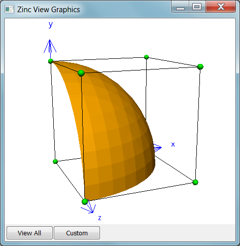

########################
Create and View Graphics
########################

This tutorial example shows how to create basic graphics to visualise models in OpenCMISS-Zinc, and how to view them interactively in a window. It uses a simple trilinear cube model but defines an additional field as a function of the cube's coordinates to give interesting curved contour inside the model. It also introduces the use of Tessellation objects which control the graphics quality for curved bodies, such as the number of line segments used to draw a curve.

This example consists of a basic interactive application with a window for showing graphics plus some buttons for control. The tutorial does not detail how to write the wider application, but focuses on the parts concerning creation of graphics and interactive viewing.

What You Need
=============

You need to install Python, the OpenCMISS-Zinc library, and PyZinc (Python bindings to Zinc) as described in earlier tutorials. For the user interface you also require Qt, PySide (Qt for Python) and the `ZincPythonTools <https://github.com/OpenCMISS-Bindings/ZincPythonTools>`_ which supply reusable widgets for showing graphics and building user interfaces with Zinc. Instructions for getting these are found elsewhere on the opencmiss.org documentation.

You will also need to download and unzip the `Zinc View Graphics Example Zip file <https://github.com/OpenCMISS-Examples/zinc_view_graphics/archive/master.zip>`_.

Running the Example
===================

Change to the ``zinc_view_graphics`` directory under the location where you unzipped the example files and run the example script with::

  python zinc_view_graphics

You should see a window containing a graphical visualisation of the cube and its fields as in the following figure:

You can manipulate the view with mouse actions: clicking and dragging with the mouse in the graphics area allows you to rotate, pan and zoom the view. The following table describes which mouse button controls which transformation.

======================= ==============
Mouse Button            Transformation
======================= ==============
Left                    Tumble/Rotate
----------------------- --------------
Middle or Shift+Left    Pan/Translate
----------------------- --------------
Right or Ctrl+Left(Mac) Fly Zoom
----------------------- --------------
Shift+Right             Camera Zoom
======================= ==============

At any time click the 'View All' button to reset the view so you can see all the graphics in the window. Exit the application by clicking on the window's close button: the red cross in the above image, or similar depending on your system.

The 'Custom' button has been set up to allow you to add your own special behaviour. Initially, each click doubles the linear quality of the tessellation, which makes the gold-coloured curved surface smoother in steps, eventually resetting to minimal straight line approximation. The code used to do this is discussed later.

The Script
==========

The main application class is a derived from a Qt 'QMainWindow' and its ``__init__()`` function creates the Zinc Context, sets up default materials and glyphs for use in graphics, and sets up the user interface widgets (defined in the zinc_view_graphics_ui.py file which was automatically generated from the .ui file created interactively in Qt Designer) including the sceneviewerwidget which draws Zinc graphics with OpenGL in the Qt window:

.. literalinclude:: zinc_view_graphics.py
  :linenos:
  :start-after: # ZincViewGraphics__init__ start
  :end-before: # ZincViewGraphics__init__ end

Practically all of the above initialisation code would be the same in any interactive Zinc application. The main customisations are firstly that the ``_makeConnections()`` function ensures the two buttons in the user interface connect to functions in this class (ZincViewGraphics):

.. literalinclude:: zinc_view_graphics.py
  :linenos:
  :start-after: # _makeConnections start
  :end-before: # _makeConnections end

Secondly, the last line calls the ``setupModel()`` function which loads the model and creates graphics, and this contains most of the content of this tutorial:

.. literalinclude:: zinc_view_graphics.py
  :linenos:
  :start-after: # setupModel start
  :end-before: # setupModel end

To help understand the above code you should have the OpenCMISS-Zinc API Reference open in another browser tab. The interface is object-oriented, meaning each class of object has particular functions that work with it. Following are some more descriptive notes:

Lines 7..15 use the *Fieldmodule* from the default *Region* which is the class providing access to its domains and fields. We know there is a 3-D coordinate field called 'coordinates' defined over this model, and to use this to supply coordinates to graphics we need to find it in the Fieldmodule. The following lines create a new field called 'mag' which is the magnitude of the coordinates vector i.e. the square root of the sum of squares of components *x*, *y* and *z*. This is one of the key features of OpenCMISS-Zinc: you can define new fields by exact mathematical expressions on other fields in the model, and visualise and compute with them as for any interpolated fields. There are dozens of field types in Zinc, covering arithmetic, trigonometric, vector, matrix, logical and other algorithmic operators on other fields; refer to the Zinc API reference for details.

Note that changes to the Fieldmodule are enclosed in ``beginChange() ... endChange()`` calls which is a common pattern in the Zinc library used to prevent excessive change messages from being sent to other parts of the Zinc library when you are making multiple changes to objects. The reason this matters is that all objects in Zinc automatically receive messages when objects they depend on change, usually via their owning module/object and they notify objects that depend on them right through to the graphics which are automatically updated on the screen. Calling ``beginChange()`` stops messages until the corresponding ``endChange()`` at which time a summary of all changes is sent. It can be quite inefficient to make large numbers of changes without using this mechanism. Note you can nest these calls as many times as you want, however you must be very careful that the corresponding number of endChange() calls are made otherwise Zinc can become unresponsive.

Lines 17..62 obtain the Scene -- the graphical rendition of a region -- and create a series of graphics in it for visualising the cube model using the fields defined on it (while temporarily stopping change messages as per the fieldmodule).

All graphics visualise parts of the domain of the model and with one exception (below) require a coordinate field to be specified which maps domain locations to [up to] 3 coordinates in space. All graphics have a material which supplies its colour (plus shading and texturing by images when things get more involved) and these are obtained by name from the list of materials in the *Materialmodule* i.e. the default materials created in the ``__init__()`` function. There are several other attributes common to all graphics which can be looked up in the API Reference.

The cube domain consists of 1 3-D cube *element* with 6 2-D square *faces* and 12 1-D *lines*. *Lines* Graphics convert the lines (line elements) into line graphics for display. By default these are drawn as lines, but they can also be drawn as extruded circles with a radius (a later tutorial).

Points graphics visualise points in the model with a glyph, a simple geometric shape with orientation and scale controlled by constants and fields, with optional text labels. Points can be drawn on any part of the domain; if shown on *Mesh* domains (elements) then the Graphicssamplingattributes control where the points are sampled. On ``NODES`` and ``DATAPOINTS`` domains there is one point per *Node* in the respective *Nodeset*. Here we draw blue axes at the origin of the coordinate system using the special ``DOMAIN_TYPE_POINT`` which is a single point in space. This is the only case where a coordinate field is optional; if not supplied the glyph is drawn at the origin (but note other options can offset it), if supplied the coordinate field must be spatially constant in this case. Point/glyph specific attributes are set via the Graphicspointattributes object obtained from this class of graphics. Most glyphs are unit-size graphics which we scale; the ``SHAPE_TYPE_AXES_XYZ`` glyph has three axes with labels, each 1.0 units long until scaled. Setting the fixed base size to 1.2 makes the arrows and lables clear the unit cube model.

**Python API Note:** The ``Graphicspointattributes.setBaseSize()`` function is an example of where the Python API differs from the documented C++ API. Since Python lists know their sizes the size arguments are omitted when supplying lists to Zinc API functions. Another difference is that you can pass a single value instead of a list with one value in it (unlike the code listed).

The cube element gets its coordinates by interpolating the 8 corner nodes which can be visualised with *Points* graphics using ``DOMAIN_TYPE_NODES``. Here we view the nodes as scaled green spheres.

Finally we will have some fun with the 'mag' field we created earlier. In simulations e.g. using OpenCMISS-Iron, you will calculate solution fields throughout the volume of the model, for example the scalar electrical potential in electrophysiology. Contours are a way of viewing values in the interior of a model, by showing the *isosurfaces* in 3-D domains (or lines in 2-D) where a scalar equals a fixed value. Here we choose to view the surface at which the 'mag' field equals 1.0, which is the equation of a sphere (but viewing only one eighth of it). However, there's a complication. The default *Tessellation* in Zinc's *Tessellationmodule*, used by default in all graphics except *Points*, divides linear element fields into only one division, non-linear into 4. To see the curvature of the mag field we create a new 'fine' tessellation with 8 divisions and apply it to the isosurfaces graphics. This causes the contours to sample the coordinates and 'mag' field at the corners of 8*8*8 sub-cubes of the element and finds where the isosurface crosses. With this cubed relationship, you can see how larger numbers may affect computation time.

The above script has set up the initial graphics, but this example has another trick in that it has a 'Custom' button which allows some custom interaction. When the button is pressed it calls the following:

.. literalinclude:: zinc_view_graphics.py
  :linenos:
  :start-after: # customButtonClicked start
  :end-before: # customButtonClicked end

Whenever the Custom button is clicked the minimum divisions in the 'fine' tessellation are doubled until reset back to 1 after exceeding 100. You can instantly see the effect on the quality of the isosurface of mag=1.0, because Zinc's internal messaging ensures the graphics are updated automatically. Bear in mind that most practical models have many more elements so you will seldom want this many divisions.

**Python API Note:** line 4 shows a case where the use of the Zinc API in Python differs from that listed in the documented C++ API. Since Python cannot modify arguments, the returned numbers of divisions are an additional return value. You still need to specify how many divisions are requested as there may be different numbers in each of the element directions. If more than one value were requested, a Python list would be returned instead of the single value. Line 9 shows the other array passing difference where it is not necessary to pass an array size into Zinc, and a scalar value can be supplied instead of a list with one value in it.

Exercises
=========

You may wish to extend this example in the following ways:
  * Label nodes with their coordinates, by setting the label field. To avoid the sphere obscuring the label, either use GLYPH_TYPE_POINT or no glyph via ``pointAttr.setGlyph(Glyph())``
  * Set the circle divisions for the default point tessellation in the tessellationmodule and look at spheres. Default value is 12; minimum is 3 but looks pretty poor.
  * Create *Surfaces* graphics. Show them with ``setRenderPolygonMode(Graphics.RENDER_POLYGON_MODE_WIREFRAME)`` and 'fine' Tessellation. Use wireframe mode for the isosurfaces. 
  * Instead of the cube, load the `trilinear_heart60.exfile <https://raw.githubusercontent.com/OpenCMISS-Examples/zinc_evaluate_field/master/triquadratic_heart60.exfile>`_ from the Zinc 'Evaluate Field' tutorial, and view its exterior surfaces, lines.
